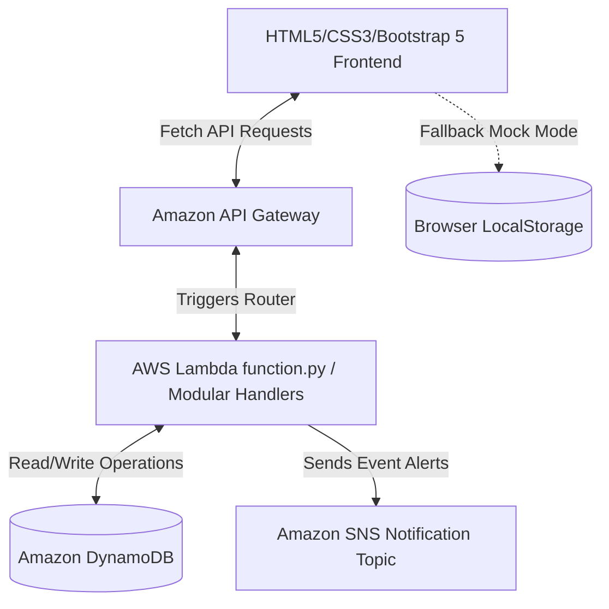

# 🚌 Bus Express - Bus Booking Application

Bus Express is a premium, RedBus-inspired responsive web application for bus ticket booking. It features a complete user registration and login framework, search and filter features, interactive seat layouts, a checkout/payment interface, personal booking histories with cancellation abilities, and a comprehensive administrative portal.

The application leverages a hybrid frontend-backend architecture: it integrates with a live **AWS Serverless infrastructure** (API Gateway, AWS Lambda handlers, DynamoDB databases, and Amazon SNS event messaging) and includes a seamless **offline LocalStorage simulation fallback** when AWS configurations are offline or unavailable.

---

## 🏗️ System Architecture



---

## 📂 Key Features

### 👤 Customer Features
- **User Authentication**: Secure Sign-up and Login.
- **Dynamic Bus Search**: Search routes between cities, filtering results by Bus Type (AC, Non-AC, Sleeper, Seater), price thresholds, departure/arrival schedules, ratings, or amenities.
- **Interactive Seat Matrix**: Real-time rendering of seat occupancy with selectable layout grids, fare trackers, and individual passenger configurations (name, age, gender).
- **Simulated Payment Gateway**: Integration with UPI, Credit/Debit cards, and Net Banking verification steps.
- **My Bookings Dashboard**: Review active and historical bookings with a full Cancellation service that automatically frees seat maps.
- **User Profile Management**: Edit and synchronize personal details (name, email, phone number).
- **Responsive & Dark Mode**: Modern layout design adapts to desktop or mobile with a customizable theme switcher.

### 🔑 Administrative Dashboard
- Pre-authorized admin panel accessible using preset credentials.
- Full CRUD operations:
  - **Create**: Add new bus routes, specifying schedules, seat counts, types, rates, and amenities.
  - **Read**: List and review all active bus schedules in the system.
  - **Update**: Modify existing bus properties (pricing, schedules, amenities, etc.).
  - **Delete**: Remove bus routes and automatically clean up associated seat registries.

---

## ⚙️ Prerequisites

To run and configure this project, you need:
- A modern web browser (Edge, Chrome, Safari, Firefox).
- Python 3.9+ (if using the backend Lambda server or hosting the frontend with python's built-in HTTP server).
- An active AWS Account (if running the serverless backend) with the AWS CLI installed and configured.

---

## 🚀 Setup & Installation

### 💻 1. Running the Frontend Locally
The frontend is built with pure HTML5, CSS3, and Vanilla JavaScript, requiring zero compile steps.

1. **Option A: Serve via Python Dev Server**
   Run the following command in the root folder of your project to start a lightweight web server:
   ```bash
   python -m http.server 8000
   ```
   Then open your browser and navigate to `http://localhost:8000`.

2. **Option B: Run via VS Code Live Server**
   If you use VS Code, install the extension **Live Server**, right-click `index.html`, and choose **"Open with Live Server"**.

---

### ☁️ 2. Deploying the AWS Serverless Backend

1. **DynamoDB Table Setup**:
   Create the following 5 tables in your target AWS region (e.g., `ap-south-1`):
   * **`Users`**: Partition key `userId` (String).
   * **`BusDetails`**: Partition key `busId` (String).
   * **`Seats`**: Partition key `busId` (String), Sort key `seatNumber` (String).
   * **`Bookings`**: Partition key `bookingId` (String).
   * **`Payments`**: Partition key `paymentId` (String).

2. **SNS Event Notifications setup**:
   - Create a standard SNS Topic named `BusBooking` in the AWS console.
   - Configure a subscription (e.g., Email or SMS) to receive confirmations.
   - Copy the Topic ARN.

3. **Deploying the AWS Lambda**:
   - Create a new Python 3.9+ Lambda Function in your AWS Console.
   - Attach IAM policies granting read/write/update access for DynamoDB tables (`Users`, `BusDetails`, `Seats`, `Bookings`, `Payments`) and publish permissions for your SNS Topic.
   - Paste the code from `lambda_function.py` (or deploy modular scripts from the `lambdas/` folder) into the Lambda editor.
   - Update target ARNs at the top of your function:
     ```python
     SNS_TOPIC_ARN = 'arn:aws:sns:YOUR_REGION:ACCOUNT_ID:BusBooking'
     ```

4. **API Gateway Settings**:
   - Create an API Gateway HTTP or REST API.
   - Point your routes (`/{proxy+}`) directly to the deployed Lambda Function.
   - Deploy your API stage (e.g., `prod`) and copy the API endpoint URL.

---

### 🔌 3. Linking Frontend and Backend

Open `js/api.js` and paste your deployed API Gateway Invoke URL into the `API_URL` variable:

```javascript
// js/api.js
const API_URL = "https://your-api-gateway-id.execute-api.ap-south-1.amazonaws.com/prod";
```

> [!NOTE]
> If `API_URL` remains set to a dummy URL or is unreachable, the system automatically falls back to **Offline LocalStorage Simulation Mode** using `DEFAULT_BUSES` configurations.

---

## 📂 Project Directory Structure

```text
├── css/
│   └── style.css            # Base design system styling, dark/light themes & glassmorphism
├── js/
│   ├── api.js               # Main API configuration & LocalStorage fallback mock databases
│   ├── admin.js             # Logic for Admin console (CRUD actions on buses)
│   ├── booking.js           # Checkout validations & passenger info management
│   ├── home.js              # Home page interactions (setting query params for search)
│   ├── login.js             # Form validation & session check for logins
│   ├── mybookings.js        # Dynamic listing of bookings and cancellations
│   ├── payment.js           # Handles payments flow interactions
│   ├── profile.js           # Edit/save user profile operations
│   ├── register.js          # Handles registration form validations
│   ├── search.js            # Bus schedules results engine with filtering rules
│   └── seat.js              # Renders the interactive seats grid and passenger profiles
├── lambdas/
│   ├── admin.py             # Administrative endpoints for managing buses
│   ├── book.py              # Reserves bus seat bookings
│   ├── login.py             # Handles user session validation
│   ├── mybookings.py        # Lists all user bookings
│   ├── payment.py           # Handles booking payments status
│   ├── profile.py           # Returns and adjusts user profile properties
│   ├── register.py          # Creates new customer records
│   └── search.py            # Searches routes in DynamoDB case-insensitively
├── lambda_function.py       # Monolithic AWS Lambda python orchestration handler
├── index.html               # Alias/Redirect landing page to login
├── login.html               # Welcome page / sign-in forms
├── register.html            # Register client accounts page
├── home.html                # Booking search landing dashboard
├── search.html              # Search results and filters page
├── seat.html                # Interlocking seat grid selector page
├── booking.html             # Check-out & passengers details registry
├── payment.html             # Payment method gateway page
├── success.html             # Seat reservation billing receipt invoice
├── mybookings.html          # Individual user bookings lists
├── profile.html             # Profile settings UI
└── admin.html               # Administrative dashboard console
```

---

## 🧪 Admin Preset Credentials

For immediate login bypass or testing configuration routines/adding bus schedules:
* **Email/Username**: `admin` or `admin@redbus.com`
* **Password**: `admin123`
